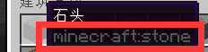

# 物品配置

## 路径

所有物品配置文件应存放于plugins/NeigeItems/Items文件夹

重复 ID 的物品仍然会被加载，但可能互相覆盖

最后哪个物品活下来。。。随缘了属于是

## 配置

详见默认配置


[mo-ren-pei-zhi.md](../../kai-shi/mo-ren-pei-zhi.md)


## 编写你的物品

### /ni save是万物起源

遇事不决，/ni save。如果不行，就/ni cover。这是最简单最便捷的快速生成物品配置的方法


[save.md](../../zhi-ling/zhi-ling-xiang-jie/wu-pin-bao-cun/save.md)



[cover.md](../../zhi-ling/zhi-ling-xiang-jie/wu-pin-bao-cun/cover.md)


某人不看配置不进游戏，草草看过两遍wiki，声称wiki看不懂，被众群友嘲笑良久。

### ID

所有物品都应该有一个ID，如下格式：

```
物品ID:
  # 具体的配置项, 以物品材质为例
  material: STONE
```

### 材质

即，物品是石头还是木头还是钻石剑

```
物品1:
  # 这个物品是石头
  material: STONE
物品2:
  # 这个物品是钻石
  material: DIAMOND
```

ID都有哪些，见下方链接



如果你看着 ID 不知道它对应什么物品。。。

一般来讲，你可以在游戏中同时按下 F3+H，启用高级显示框，这样物品下方就会出现对应的ID。
