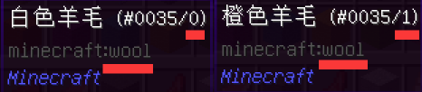

# 物品配置

## 路径

所有物品配置文件应存放于plugins/NeigeItems/Items文件夹

重复 ID 的物品仍然会被加载，但可能互相覆盖

最后哪个物品活下来。。。随缘了属于是

## 配置

详见默认配置


[mo-ren-pei-zhi.md](../../kai-shi/mo-ren-pei-zhi.md)


## 编写你的物品

### /ni save是万物起源

遇事不决，/ni save。如果不行，就/ni cover。这是最简单最便捷的快速生成物品配置的方法


[save.md](../../zhi-ling/zhi-ling-xiang-jie/wu-pin-bao-cun/save.md)



[cover.md](../../zhi-ling/zhi-ling-xiang-jie/wu-pin-bao-cun/cover.md)


某人不看配置不进游戏，草草看过两遍wiki，声称wiki看不懂，被众群友嘲笑良久。

### ID

所有物品都应该有一个ID，如下格式：

```
物品ID:
  # 具体的配置项, 以物品材质为例
  material: STONE
```

### 材质

即，物品是石头还是木头还是钻石剑

```
物品1:
  # 这个物品是石头
  material: STONE
物品2:
  # 这个物品是钻石
  material: DIAMOND
```

ID都有哪些，见下方链接



如果你看着 ID 不知道它对应什么物品。。。

一般来讲，你可以在游戏中同时按下 F3+H，启用高级显示框，这样物品下方就会出现对应的ID。

如上图所示，minecraft:stone 对应 STONE

对于 mod 物品，前缀不能省略。

比如一个名称为mod:test的物品，对应的 ID 应为 MOD\_TEST

但是啊但是，你有没有看上面啊？

/ni save是万物起源。别搁这儿看ID了，保存一下什么都有了，看个锤子看。

### 物品名

具体配置如下

```
有名字的铁剑:
  material: IRON_SWORD
  name: 我有名字
```

### 物品Lore

具体配置如下

```
有Lore的铁剑:
  material: IRON_SWORD
  lore:
  - 我有lore
  - 我真有lore
  - 信我
```

### 子ID/损伤值

在 1.12.2 及以下的版本中，某些物品存在“子ID”。

比如 WOOL 是白色羊毛，而子ID为 1 的 WOOL 是橙色羊毛。



对应配置方法如下

```
白色羊毛:
  material: WOOL
橙色羊毛:
  material: WOOL
  # 子ID为1
  damage: 1
```

而对于有耐久的物品，damage对应损伤值，即，物品消耗了几点耐久。

```
铁剑:
  material: IRON_SWORD
用了一下的铁剑:
  material: IRON_SWORD
  # 消耗了1点耐久
  damage: 1
```

### CustomModelData

对于 1.14+ 的服务器，物品有了一个新的属性，CustomModelData。

一般人们用它搭配材质包制作自定义材质物品。

对应配置方法如下

```
铁剑:
  material: IRON_SWORD
  # CustomModelData 为 1
  custommodeldata: 1
```

### 附魔

附魔名称列表，应前往以下链接查看



具体配置方法如下

```
有附魔的铁剑:
  material: IRON_SWORD
  enchantments:
    # 锋利5
    DAMAGE_ALL: 5
```

啥？你说全是英文你根本看不懂哪个对哪个？

/ni save干什么用的

### 无法破坏

具体配置如下

```
无法破坏的铁剑:
  material: IRON_SWORD
  unbreakable: true
```

### 隐藏属性

有的物品明明无法破坏，物品信息里却看不到。

有的物品明明有附魔，物品信息里却看不到。

具体配置方法如下

```
啥都看不到的铁剑:
  material: IRON_SWORD
  hideflags:
  # 隐藏物品属性
  - HIDE_ATTRIBUTES
  # 隐藏物品可破坏方块
  - HIDE_DESTROYS
  # 隐藏物品染料颜色
  - HIDE_DYE
  # 隐藏物品附魔
  - HIDE_ENCHANTS
  # 隐藏物品可放置方块
  - HIDE_PLACED_ON
  # 隐藏物品药水效果
  - HIDE_POTION_EFFECTS
  # 隐藏物品无法破坏
  - HIDE_UNBREAKABLE
```
